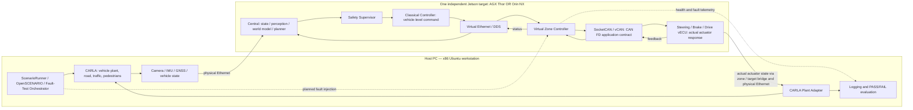

# StrataDrive

**StrataDrive — Compute-Aware Autonomous Driving System with Zonal E/E Architecture**

## Current Status

**M0 — Architecture & Requirement Baseline**

This repository is at the bootstrap / architecture design stage. Documents, draft
contracts, profile placeholders and a configure-only CMake skeleton exist. Runtime
components, DBC/IDL definitions, control, AI, deployment and vehicle tests are
**Planned / TBD**, with no measured vehicle or compute results. M0 acceptance still
requires the learner's design review and resolution of the baseline questions.

## Project Overview

StrataDrive is a learning and verification project for a Central Compute → Zone
Controller → Leaf ECU vehicle software architecture in a planned CARLA closed-loop
software-in-the-loop (SIL) environment. It connects vehicle control, distributed
communication, virtual ECUs, timing, diagnostics and Physical AI with deployment
under different compute budgets.

## Motivation

The project goes beyond a simulator driving demo or an inference benchmark: the
engineering focus is whether a complete vehicle feature configuration can meet
explicit requirements on each compute tier. Understanding the architecture and
explaining each implementation take priority over generating code quickly.

## Key Engineering Questions

- How should vehicle commands, zone allocation and actuator response be separated?
- How do stale messages, ECU loss and actuator faults affect closed-loop behavior?
- Which timing tails and deadline misses matter beyond average AI latency?
- How can a learned planner assist a bounded classical control path?
- Which features satisfy the same requirements within each board's resource budget?

## System Architecture

The diagram is a **planned topology**, not an implemented deployment.



Thor and Orin are **independent alternative targets**. They are never combined into
one vehicle. Central and Zone are planned as distinct logical Ethernet nodes on
one Linux target using Docker networking or network namespaces plus veth pairs.
The Host–Jetson link uses real Ethernet. Zone–Leaf communication uses SocketCAN/vCAN;
vCAN does not reproduce CAN FD electrical behavior, physical arbitration or bus timing.

The controller must never move the vehicle by calling CARLA directly. The required
loop is: CARLA sensor/state → Central → Planner → Safety Supervisor → Controller
→ Vehicle Command → virtual Ethernet → Zone → CAN FD command → vECU → **actual
actuator state** → Plant Adapter → vehicle motion → next sensor frame. The adapter
is the sole planned ego actuation writer; translating feedback to CARLA inputs
and avoiding double-counted actuator dynamics remain design work.

See [system architecture](docs/architecture/system_architecture.md),
[software contracts](docs/architecture/software_architecture.md) and
[deployment architecture](docs/architecture/deployment_architecture.md).

## Compute Tier Strategy

Run the same **Reference Config** independently on both boards first, with the same
scenario, requirements, model/input settings and measurement protocol. Then explore
**AGX Thor: Premium Compute Profile** and **Orin NX: Mainstream Compute Profile**.
Compare AI and camera-to-trajectory latency, FPS, CPU/GPU utilization, RAM, power,
temperature, control jitter and deadline misses. No performance numbers are claimed.

Candidate changes include FP16 → INT8, Medium → Small model, 1080p → 720p,
30 → 20 FPS, optional segmentation disable, smaller temporal hidden size and feature
gating. Quantization and feature removal require accuracy and vehicle behavior
revalidation; configuration details are TBD. See [profiles](profiles/README.md).

## Scope / Non-Scope

M0 covers requirements, architecture, ICD templates, ADRs, verification planning and
learning workflow. Later milestones plan classical driving before AI, actuator
models, faults and fair compute comparisons.

M0 does not install CARLA, download models, implement production software or run
vehicle tests. QNX, AUTOSAR, hardware-in-the-loop (HIL), certified functional safety
and ISO 26262 compliance are not implemented or claimed. The Linux vECU model is
an educational MCU/RTOS approximation. CARLA is not asserted equivalent to
CarMaker, CANoe or dSPACE, and this project is not evidence of road readiness.

## Planned Tech Stack

| Area | Planned choice / unresolved selection |
| --- | --- |
| Host simulation | x86 Ubuntu, CARLA 0.9.16 family initial candidate; exact compatible versions TBD |
| Core software | C++ and CMake; language standard and compiler versions TBD |
| Orchestration / analysis | Python, pytest; versions TBD |
| Communication | DDS over virtual Ethernet; vendor, direct DDS vs ROS 2 TBD; SocketCAN/vCAN |
| Isolation | Docker network or Linux network namespaces + veth; selection TBD |
| Target | One Jetson AGX Thor or one Jetson Orin NX; board-specific platform stack TBD |
| Physical AI | Pretrained perception, TensorRT export/inference; GRU or small Temporal Transformer later |
| Quality | GoogleTest, clang-tidy, cppcheck, ASan, UBSan and regression suites, all Planned |

Configure the M0 scaffold with an existing CMake installation:

```sh
cmake -S . -B build
```

This only configures an empty project; it does not compile, fetch or execute any
vehicle software. No application run command exists at M0.

## Development Principles

1. Define requirements and interfaces before code; keep undecided values as TBD.
2. Preserve the Central → Zone → vECU → Plant boundary in every closed-loop test.
3. Keep AI outputs at trajectory/target-speed/risk level, with safety checks,
   a classical controller and classical planner fallback.
4. Measure execution, jitter, tails, deadlines and fault response with explicit clocks.
5. Maintain Requirement → Component → Interface → Test → Result traceability.
6. Review a small change, run it personally and explain it before accepting it.

See [learning principles](docs/learning/README.md),
[quality policy](docs/quality_policy.md) and
[verification strategy](docs/test-plan/verification_strategy.md).

## Milestone Roadmap

| Milestone | Planned focus |
| --- | --- |
| M0 | Architecture / Requirement / ICD Baseline — current draft |
| M1 | DBC + vCAN |
| M2 | Steering / Brake / Drive vECU |
| M3 | Real-Time Timing & Scheduling Measurement |
| M4 | Virtual Zone Controller |
| M5 | Central Compute + DDS |
| M6 | Simple Vehicle Plant |
| M7 | CARLA Integration |
| M8 | Classical Autonomous Driving |
| M9 | Fault / Diagnostics / DTC |
| M10 | Physical AI Perception |
| M11 | Learned Temporal Planner |
| M12 | Thor vs Orin Compute-Tier Optimization |
| M13 | Final SIL / V&V / Regression |

Detailed proposed acceptance evidence is in [the roadmap](docs/roadmap.md).
Fault contracts start at M0 and local fault behavior is planned with the relevant
components; M9 integrates diagnostics and DTCs across the full system.

## Repository Structure

```text
StrataDrive/
├── README.md, .gitignore, .gitattributes, CMakeLists.txt
├── docs/
│   ├── requirements/      # System, timing and safety drafts
│   ├── architecture/      # System, software, deployment and fault contracts
│   ├── icd/               # Interface inventory, DDS and CAN templates
│   ├── adr/               # Four design decisions
│   ├── test-plan/         # Verification strategy and traceability
│   ├── learning/          # Learner-led workflow
│   ├── roadmap.md
│   └── quality_policy.md
├── interfaces/            # dbc/, dds/, common/ — placeholders
├── central/               # State, perception, world model, planning, control, safety, health, diagnostics
├── zone/                  # Gateway, validation, allocation, local safety
├── vecu/                  # Common task model, steering, brake, drive
├── simulation/            # Simple plant, CARLA, adapter, scenarios, fault injection
├── physical_ai/           # Perception, learned planner, export, inference
├── profiles/              # Reference / Thor Premium / Orin Mainstream design data
├── tests/                 # Unit, integration, SIL, fault, performance — placeholders
├── benchmark/             # Timing, compute, reviewed results
├── deploy/                # Docker, systemd, scripts — placeholders
├── models/README.md       # Large artifact policy and small sample exceptions
└── tools/                 # Placeholder
```

Start reading with [system requirements](docs/requirements/system_requirements.md)
and [open M0 decisions](docs/roadmap.md#open-m0-decisions).
