# StrataDrive

**StrataDrive — Compute-Aware Autonomous Driving System with Zonal E/E Architecture**

## Current Status

**M0 — Architecture / Requirement / ICD Baseline: BASELINED**

**StrataDrive Reference Baseline v0.1**의 system contract와 verification baseline을 정의했다.
[종료 검토](docs/m0_baseline.md)의 15개 항목을 모두 통과했다. ODD, 정상 3개/
fault 4개 scenario, command/actual 책임, logical rates, timeout/state, traceability가 문서 범위다.
숫자는 engineering starting point이며 양산차 기준이나 실측 결과가 아니다.

현재 실제 repository에는 문서, 설계용 YAML, directory placeholder, configure-only CMake
골격이 있다. DBC/vCAN/vECU/CARLA/ROS 2·DDS/control/AI/deployment runtime은
**PLANNED**, 모든 차량/성능 시험은 **NOT RUN**이다. M1 이후 구현은 시작하지 않았다.

## Project Overview

StrataDrive는 CARLA 기반 closed-loop software-in-the-loop (SIL) 환경에서
Central Vehicle Compute → Zone Controller → Leaf ECU 차량 software architecture를
학습하고 검증하기 위한 프로젝트다. 차량 제어, 분산 통신, vECU, timing, diagnostics,
Physical AI를 서로 다른 compute budget에 맞춘 배포와 함께 다룰 계획이다.

## Motivation

Simulator 주행 데모나 inference benchmark를 넘어, 각 compute tier에서 차량의
전체 feature 구성이 명시된 요구사항을 만족하는지 살펴본다. 빠른 코드 생성보다
architecture를 이해하고 각 구현을 직접 설명할 수 있는 것을 우선한다.

## Key Engineering Questions

- Vehicle command, Zone Controller의 allocation, actuator response를 어떻게 분리할 것인가?
- Stale message, ECU 통신 상실, actuator fault는 closed-loop 동작에 어떤 영향을 주는가?
- 평균 AI latency 외에 어떤 timing tail과 deadline miss를 살펴봐야 하는가?
- Learned Planner는 제한이 정의된 Classical Controller 경로를 어떻게 보조할 수 있는가?
- 각 보드의 resource budget 안에서 어떤 feature가 동일한 요구사항을 만족하는가?

## System Architecture

아래 그림은 **Planned topology**이며 아직 구현된 배포 구성이 아니다.

```mermaid
flowchart LR
  subgraph HOST[Host PC — x86 Ubuntu workstation]
    CARLA[CARLA: vehicle plant, road, traffic, pedestrians]
    SENS[Camera / IMU / GNSS / vehicle state]
    TEST[ScenarioRunner / OpenSCENARIO / Fault-Test Orchestrator]
    ADAPTER[CARLA Plant Adapter]
    LOG[Logging and PASS/FAIL evaluation]
    CARLA --> SENS
    TEST --> CARLA
    ADAPTER --> CARLA
  end
  subgraph TARGET[One independent Jetson target: AGX Thor OR Orin NX]
    CENTRAL[Central Vehicle Compute: state / perception / world model / planner]
    SAFETY[Safety Supervisor]
    CONTROL[Classical Controller: vehicle-level command]
    ETH[Virtual Ethernet / DDS]
    ZONE[Virtual Zone Controller]
    CAN[SocketCAN / vCAN: CAN FD application contract]
    ECU[Steering / Brake / Drive vECU: actual actuator feedback]
    CENTRAL --> SAFETY --> CONTROL --> ETH --> ZONE --> CAN --> ECU
    ECU -->|feedback| CAN
    CAN --> ZONE
    ZONE -->|status| ETH
    ETH --> CENTRAL
  end
  SENS -->|physical Ethernet| CENTRAL
  ECU -->|actual actuator feedback via Zone / target bridge and physical Ethernet| ADAPTER
  TEST -. planned fault injection .-> ZONE
  ZONE -. health and fault telemetry .-> LOG
  ADAPTER --> LOG
```



Thor와 Orin은 **서로 독립적인 대체 Target**이며, 두 보드를 결합해 하나의 차량을
구성하지 않는다. Central Vehicle Compute와 Zone Controller는 하나의 Linux Target에서
Docker network 또는 network namespace + veth pair로 논리적으로 별도인 Ethernet node를
구성할 계획이다. Host–Jetson은 실제 Ethernet, Zone Controller–Leaf ECU는 SocketCAN/vCAN을
사용한다. vCAN은 CAN FD의 전기적 동작, 물리적 arbitration, bus timing을 재현하지 않는다.

**Vehicle-level command != actuator command != actual actuator feedback**이다.
Central Classical Controller는 target speed와 acceleration/curvature/braking demand를 생성하고, Zone은
Steering/Drive/Brake command로 allocation하며, vECU는 task/delay/saturation/dynamics/fault를
거친 actual actuator feedback을 생성한다. Controller/Zone의 request는 actual state가 아니다.

필수 closed-loop는 CARLA Sensor / Vehicle State → Central Vehicle Compute → Planner →
Safety Supervisor → Classical Controller → Vehicle-level Command → logical Ethernet / DDS →
Zone Controller → CAN application contract → Steering/Brake/Drive vECU → Actual Actuator
Feedback → Zone/Target feedback bridge → Physical Ethernet → Host Plant Adapter → CARLA
Vehicle Motion → next sensor frame이다.

Planner/Controller/Zone의 CARLA direct actuation, vECU command의 actual 간주,
actual loss 시 raw command fallback은 금지한다. **Plant Adapter만 ego actuation single writer**다.
Host orchestrator는 tick을 소유한다. Actual이 invalid/stale/missing이면 다음 apply/tick을
보류한다. 이는 simulation containment이며 물리적 안전 정지의 검증이 아니다.

상세 내용은 [system architecture](docs/architecture/system_architecture.md),
[software 계약](docs/architecture/software_architecture.md),
[배포 architecture](docs/architecture/deployment_architecture.md)를 참조한다.

## Reference Baseline v0.1

| 항목 | M0 정의 |
| --- | --- |
| ODD | 맑은 낮, 포장도로, 단일 ego, 신호등 없는 직선/완만한 곡선, 0–40 km/h; 복잡한 교차로/traffic interaction 제외 |
| 정상 scenario | S01 직선 30 km/h, S02 곡선 30 km/h, S03 직선→곡선→직선 및 30→20 km/h request |
| 주행 acceptance | steady speed max absolute error <=1 km/h; lateral absolute P95 <=0.3 m; heading absolute P95 <=3 deg; positive validated target 대비 overspeed <=10% |
| 통신 | critical command/actual loss는 마지막 valid RX부터 <=100 ms에 검출; invalid/stale command는 valid age 갱신 금지 |
| Logical rates | simulation/sensor·Planner 20 Hz, Controller 50 Hz, Zone·Steering/Brake/Drive vECU 100 Hz |
| State | INIT → NORMAL → DEGRADED → FAIL_SAFE; critical loss는 FAIL_SAFE 직행, recovery는 explicit INIT 재검증 |

수치와 평가 window는 [scenario baseline](docs/test-plan/scenario_baseline.md), 시간 정의는
[timing contract](docs/requirements/timing_requirements.md)에 있다. M3/M6/M7/M8 측정·tuning으로
변경할 때 requirement revision/rationale과 profile/test를 함께 갱신한다.

## Compute Tier Strategy

먼저 동일한 scenario, 요구사항, model/input 설정, 측정 protocol을 사용하는
**Reference Config**를 두 보드에 각각 독립 실행한다. 이후 **AGX Thor: Premium Compute
Profile**과 **Orin NX: Mainstream Compute Profile**을 탐색한다. AI latency,
camera-to-trajectory latency, FPS, CPU/GPU utilization, RAM, power, temperature,
control jitter, deadline miss를 비교할 계획이며 현재 주장하는 성능 수치는 없다.

최적화 후보는 FP16 → INT8, Medium → Small model, 1080p → 720p, 30 → 20 FPS,
optional segmentation 비활성화, temporal hidden size 축소, feature gating이다.
Quantization과 feature 제거 후에는 정확도와 차량 동작을 다시 검증해야 한다.
상세 설정은 TBD이며 [profile 설명](profiles/README.md)에 정리한다.

## Scope / Non-Scope

M0에서는 요구사항, architecture, semantic ICD baseline, ADR, 검증 계획, 학습 절차를 다룬다.
이후 milestone에서는 AI보다 classical driving을 먼저 구현하고, actuator model,
fault, 공정한 compute 비교를 다룰 계획이다.

M0에서는 CARLA 설치, model 다운로드, production software 구현, 차량 시험을
수행하지 않는다. QNX, AUTOSAR, hardware-in-the-loop (HIL)의 적용이나 functional safety
인증, ISO 26262 준수를 주장하지 않는다. Linux vECU model은 MCU/RTOS 학습을 위한
근사 모델이다. CARLA가 CarMaker, CANoe, dSPACE와 동등하다고 주장하지 않으며,
이 프로젝트가 실제 도로 운행 준비를 입증하는 것은 아니다.

## Planned Tech Stack

| 영역 | 계획된 선택 / 미결정 사항 |
| --- | --- |
| Host simulation | x86 Ubuntu, CARLA 0.9.16 계열 초기 후보; 정확한 호환 버전 TBD-07 (M7) |
| Core software | C++와 CMake; 언어 표준과 compiler 버전 TBD-11 (M1) |
| Orchestration / analysis | Python, pytest; 버전 TBD-11 (M1) |
| Communication | Virtual Ethernet 기반 DDS; vendor, direct DDS vs ROS 2 TBD-05 (M5); SocketCAN/vCAN |
| Isolation | Docker network 또는 Linux network namespace + veth; 선택 TBD-05 (M4/M5) |
| Target | Jetson AGX Thor 또는 Jetson Orin NX 한 대; 보드별 platform stack TBD-09 (M5) |
| Physical AI | Pretrained perception, TensorRT export/inference; 이후 GRU 또는 작은 Temporal Transformer |
| Quality | GoogleTest, clang-tidy, cppcheck, ASan, UBSan과 regression suite; 모두 Planned |

기존에 설치된 CMake로 M0 골격을 configure할 수 있다.

```sh
cmake -S . -B build
```

이 명령은 빈 프로젝트의 configure만 수행한다. 차량 software를 컴파일하거나
다운로드·실행하지 않으며, M0에는 application 실행 명령이 없다.

## Development Principles

1. 코드보다 요구사항과 interface를 먼저 정의하고, 미결정 값은 TBD로 남긴다.
2. 모든 closed-loop 시험에서 Central Vehicle Compute → Zone Controller → vECU → Plant 경계를 유지한다.
3. AI 출력은 trajectory/target speed/risk로 제한하고, safety 검사와 Classical Controller,
   Classical Planner fallback을 거친다.
4. Clock 기준을 명시하고 execution, jitter, tail, deadline, fault response를 측정한다.
5. Requirement → Component → Interface → Test → Result의 추적성을 유지한다.
6. 작은 변경을 검토하고 직접 실행한 뒤, 내용을 설명할 수 있을 때 수용한다.

상세 내용은 [학습 원칙](docs/learning/README.md),
[품질 정책](docs/quality_policy.md),
[검증 전략](docs/test-plan/verification_strategy.md)을 참조한다.

## Milestone Roadmap

| Milestone | 계획 범위 |
| --- | --- |
| M0 | Architecture / Requirement / ICD Baseline — BASELINED |
| M1 | DBC + vCAN |
| M2 | Steering / Brake / Drive vECU |
| M3 | Real-Time Timing & Scheduling Measurement |
| M4 | Virtual Zone Controller |
| M5 | Central Compute + DDS |
| M6 | Simple Vehicle Plant |
| M7 | CARLA Integration |
| M8 | Classical Autonomous Driving |
| M9 | Fault / Diagnostics / DTC |
| M10 | Physical AI Perception |
| M11 | Learned Temporal Planner |
| M12 | Thor vs Orin Compute-Tier Optimization |
| M13 | Final SIL / V&V / Regression |

Acceptance 증거의 상세 후보는 [로드맵](docs/roadmap.md)에 정리한다.
Fault 계약은 M0부터 정의하며, local fault 동작은 관련 component와 함께 설계할 계획이다.
M9에서는 전체 시스템의 diagnostics와 DTC를 통합한다.

## Repository Structure

```text
StrataDrive/
├── README.md, .gitignore, .gitattributes, CMakeLists.txt
├── docs/
│   ├── requirements/      # System, timing, safety baseline
│   ├── architecture/      # System, software, 배포, fault 계약
│   ├── icd/               # Interface 의미, DDS/CAN 계약; wire layout은 후속 단계
│   ├── adr/               # 설계 결정 네 개
│   ├── test-plan/         # 검증 전략, scenario baseline, 추적성
│   ├── learning/          # 학습자 중심 절차
│   ├── m0_baseline.md     # Exit checklist와 문서 검토 증거
│   ├── roadmap.md
│   └── quality_policy.md
├── interfaces/            # dbc/, dds/, common/ — 배치용 placeholder
├── central/               # State, perception, world model, planning, control, safety, health, diagnostics
├── zone/                  # Gateway, validation, allocation, local safety
├── vecu/                  # Common task model, steering, brake, drive
├── simulation/            # Simple plant, CARLA, Plant Adapter, scenarios, fault injection
├── physical_ai/           # Perception, learned planner, export, inference
├── profiles/              # Reference / Thor Premium / Orin Mainstream 설계 data
├── tests/                 # Unit, integration, SIL, fault, performance — 배치용 placeholder
├── benchmark/             # Timing, compute, 검토된 결과
├── deploy/                # Docker, systemd, scripts — 배치용 placeholder
├── models/README.md       # 대용량 artifact 정책과 작은 sample 예외
└── tools/                 # 배치용 placeholder
```

[시스템 요구사항](docs/requirements/system_requirements.md)과
[M0 baseline summary](docs/m0_baseline.md)를 먼저 읽고,
[후속 단계의 TBD](docs/roadmap.md#open-m0-decisions)에서 owner/결정 milestone을 확인하면 된다.
