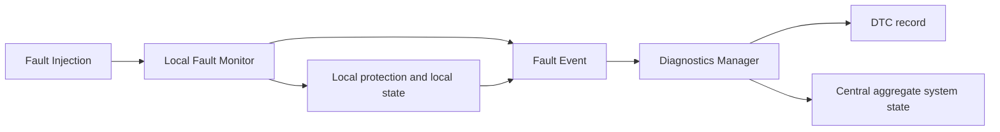

# Fault / diagnostics architecture

Status: M0 계약 **DEFINED**, fault monitor/state machine/DTC runtime **PLANNED**.

DTC 저장 완료는 state transition이나 local protection의 선행 조건이 아니다.
Zone/vECU는 Central communication이 없어도 timeout을 검출하고 보호 동작을 수행한다.
Local state와 Central aggregate state의 시각을 구분한다. 통신 단절 중 Central의
상태 표시는 늦거나 unknown일 수 있으며 이를 local NORMAL의 증거로 쓰지 않는다.
재연결 시 더 낮은 severity로 자동 덮어쓰지 않고 INIT 재검증한다.

## Detection ownership

Fault 이름은 논리적 이름이며 numerical DTC mapping은 M9(TBD-08)이다.

| Fault name / scenario | Primary detector | 독립 관측 / 최소 반응 |
| --- | --- | --- |
| STEERING_ECU_LOSS / F01 | Zone steering actual feedback age | Host Plant Adapter per-actuator age; unavailable, FAIL_SAFE, run gate |
| CAN_CRC_ERROR / F02 | 수신 vECU, feedback의 경우 Zone | reject + valid RX age 미갱신; 오류 반복으로 timeout 가능 |
| ALIVE_COUNTER_ERROR / F02 | 수신 vECU/Zone의 sequence 검사 | duplicate/out-of-order/잘못된 epoch reject; 정상 heartbeat로 대체 불가 |
| COMMAND_STALE / F02 | 수신 vECU/Zone의 source freshness 검사 | reject, timeout 보호는 계속 진행 |
| DRIVE_COMMAND_LOSS / F03 | Drive vECU local valid-command age | zero-propulsive target, local FAIL_SAFE, actual response 별도 기록 |
| CENTRAL_COMM_LOSS / F04 | Zone valid VehicleCommand age | local FAIL_SAFE/보호 allocation; Central diagnostics 의존 없음 |
| STEERING_COMMAND_LOSS | Steering vECU local command age | local FAIL_SAFE; hold/rate/가용성 정책 M2에서 고정 |
| BRAKE_COMMAND_LOSS | Brake vECU local command age | local FAIL_SAFE; brake 초기/유지/감압 정책 M2에서 고정 |
| BRAKE_ECU_LOSS / DRIVE_ECU_LOSS | Zone의 각 actual feedback age | Host도 per-actuator stream 확인; brake 상실에서 정지 보장 금지 |
| ACTUAL_FEEDBACK_STALE | Host Plant Adapter 원천 sequence/time/validity | bridge heartbeat와 독립 검출, run gate; cached actual을 fresh로 처리 금지 |
| STEERING_TRACKING_FAULT / BRAKE_RESPONSE_FAULT | 해당 vECU demand↔actual residual | threshold/dwell/model이 정해진 후 검증(M2); Zone의 availability에 전달 |
| TASK_OVERRUN | 각 component deadline monitor/watchdog | task 자체 정지 감시 독립성 M3 결정; miss와 local state 기록 |
| COMPUTE_OVERLOAD | Central health + task timing monitors | optional feature 축소 / 필수 경로 protection; M3/M12 검증 |
| AI_INFERENCE_TIMEOUT / AI_OUTPUT_INVALID | Central inference monitor / Safety Supervisor | 유효 classical fallback 또는 FAIL_SAFE; M11 |

## Top-level state contract

기본 severity 흐름은 **INIT → NORMAL → DEGRADED → FAIL_SAFE**다. 모든 고장이
DEGRADED를 거쳐야 하는 것은 아니며 critical path loss는 NORMAL→FAIL_SAFE로 직행한다.

| State | 의미 / 진입 | 허용 이탈 |
| --- | --- | --- |
| INIT | startup 또는 명시적 reinitialize; normal output 금지, 입력/feedback/health 검증 | 필수 조건 충족 시 NORMAL; startup fault 지속 시 FAIL_SAFE |
| NORMAL | 필수 stream/health 유효, reference envelope 안에서 운행 | 제한된 optional fault는 DEGRADED, critical fault는 FAIL_SAFE |
| DEGRADED | 미리 검증된 제한 envelope의 기능 축소 | critical fault/envelope 이탈 시 FAIL_SAFE; recovery 요청 시 INIT |
| FAIL_SAFE | local 보호 동작, 정상 운행 중단; 안전 정지 보장 의미 아님 | 원인 해소 + 명시적 recovery 요청 시 INIT만 허용 |

M0 F01/F03/F04 및 F02 지속 후 timeout은 보수적으로 FAIL_SAFE를 선택한다.
Actuator가 불확실한 상태에서 계속 운행할 DEGRADED envelope는 아직 없기 때문이다.
동시 fault는 FAIL_SAFE 우선이며 복구는 자동 severity 하향 없이 gate를 거친다.
RECOVERY는 별도 top-level state가 아니라 INIT 재검증 절차다. 상세 dwell과 local
actuator 물리 동작은 [safety contract](../requirements/safety_requirements.md)의 TBD다.

## Fault evidence contract

Event에는 fault name, source component, severity/local state, 영향 Interface/Requirement,
run/epoch, clock domain, last-valid RX, injection onset(시험 시), detection time,
예상/관측값(age/counter/CRC), local action/time을 남긴다. Central 수신 시간과 실제
actuator response time은 각각 별도 필드다. 원천 event를 재전송할 때 검출 시각을 바꾸지 않는다.

M9에서 DTC code, occurrence count, pending/confirmed/cleared, debounce, persistence,
clear policy를 추가한다. DTC는 프로젝트 진단 코드이며 UDS/OBD 구현을 뜻하지 않는다.
Event 기록이 없어도 local protection은 실행되어야 하며 logging loss는 검증 증거 결손으로
명시한다. [Timing](../requirements/timing_requirements.md)과
[verification](../test-plan/verification_strategy.md)에 연결한다.
