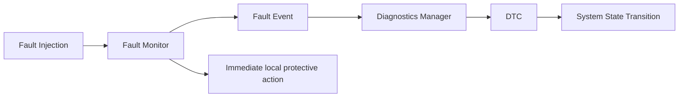

# Fault / diagnostics architecture

Status: M0 **Planned / TBD**. Fault 처리, DTC storage와 state machine은 미구현이다.

위 기본 흐름은 기록/상태관리 관계다. Diagnostics Manager/DTC 처리 완료를 기다리느라
local protection을 지연해서는 안 된다. Zone Controller/vECU는 Central Vehicle Compute 통신 단절 중에도 자신의
timeout/fault 정책을 적용하는 방향이다. State 보고가 늦을 수 있으므로 local state와
Central Vehicle Compute system state를 구분하여 기록하고 재연결 시 reconcile 규칙을 정한다.

## Candidate monitors and reactions

모든 reaction은 **정책 후보 / TBD**이며 actuator 가용성과 scenario 검토 후 확정한다.
Candidate 문자열은 fault name이며 아직 numerical DTC mapping이 아니다.

| Fault 후보 | 계획된 monitor | 결과 동작 후보 |
| --- | --- | --- |
| CENTRAL_COMM_LOSS | Zone Controller valid command age | local 제한/controlled-stop 가능성 평가 |
| STEERING_ECU_LOSS | Zone Controller valid steering feedback age | steering 가용성 상실, DEGRADED/FAIL_SAFE 정책 |
| BRAKE_ECU_LOSS | Zone Controller brake feedback age | brake 의존 stop을 보장하지 않음; scenario별 대안 검토 |
| DRIVE_ECU_LOSS | Zone Controller drive feedback age | torque 가용성 상실, 제한/중단 |
| STEERING_TRACKING_FAULT | Steering demand와 actual 값의 residual | 지속성/threshold 검증 후 제한 |
| BRAKE_RESPONSE_FAULT | Brake response envelope | pressure buildup/response delay 이상 판단 |
| CAN_CRC_ERROR | 수신 측 Zone Controller/vECU의 application CRC 검사 | frame reject; invalid frame으로 freshness 갱신 금지 |
| ALIVE_COUNTER_ERROR | 수신 측 Zone Controller/vECU의 counter 검사 | duplicate/out-of-order/restart 정책 적용 |
| AI_INFERENCE_TIMEOUT | Central Vehicle Compute inference age/deadline | Classical Planner fallback |
| AI_OUTPUT_INVALID | Safety Supervisor 검증: finite/range/shape/feasibility | candidate reject, fallback 또는 안전 상태 |
| TASK_OVERRUN | task deadline monitor / watchdog | task별 영향에 따른 local 보호 및 event |
| COMPUTE_OVERLOAD | Central Vehicle Compute의 health와 timing monitor | optional feature gating/감속 후보; safety task budget 보존 |

## State contract

| State | 의미 | 진입/이탈 계약 후보 |
| --- | --- | --- |
| NORMAL | 필수 interface/기능이 검증된 운행 상태 | startup checks 성공 후에만 진입 |
| DEGRADED | 정의된 제한 아래 일부 기능 운용 | fault별 허용 feature/speed/제한 TBD |
| FAIL_SAFE | scenario와 가용 actuator에 맞는 보호 동작 상태 | 심각한 fault 또는 degraded envelope 이탈; 안전 보장 표현 아님 |
| RECOVERY | fault clear 이후 health 재검증/재동기화 | dwell/rejoin/수동승인 정책 만족 전 NORMAL 복귀 금지 |

초기 상태는 RECOVERY 후보이며 초기 출력과 startup grace는 TBD다.
NORMAL → DEGRADED/FAIL_SAFE; DEGRADED → FAIL_SAFE/RECOVERY;
FAIL_SAFE → RECOVERY; RECOVERY → NORMAL 또는 fault 재발 시 DEGRADED/FAIL_SAFE를
검토한다. FAIL_SAFE → NORMAL 즉시 자동 복귀는 baseline 후보에서 허용하지 않는다.
동시 fault의 severity 우선순위/latching 규칙과 recovery 권한은 미결정이다.

## Fault event / DTC template

- Event ID, source component, fault name, severity, 영향받는 Interface / Requirement: TBD
- Run ID, source timestamp + clock domain, 검출 timestamp, sequence: TBD
- 최초/최근 발생, 발생 횟수, current/pending/confirmed/cleared state: TBD
- 증거: 예상/관측값, counter/CRC/age, local action과 동작 시각: TBD
- 수치 DTC mapping, debounce/confirmation, 저장 유지, clear/복구 정책: TBD

DTC는 프로젝트 진단 코드이며 UDS/OBD 표준 구현을 의미하지 않는다. Fault injection은
scenario 정의에 onset/duration/target/seed와 expected monitor/state를 남긴다. 검출 시간,
local action, system state transition, 실제 actuator response 시점을 각각 관측한다.
[Timing](../requirements/timing_requirements.md)과
[verification](../test-plan/verification_strategy.md)에 증거를 연결한다.
