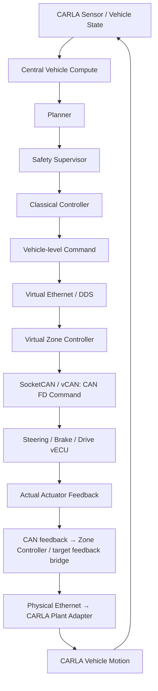

# System architecture

Status: M0 **DEFINED / Reference Baseline v0.1**. 계약은 확정했으며 배포/runtime은
PLANNED, 동작/성능 시험은 NOT RUN이다.

## 경계와 책임

| Component ID | 배치 / 책임 | 경계 |
| --- | --- | --- |
| ARCH-HOST | x86 Ubuntu workstation: CARLA Vehicle Plant / Road / Traffic / Pedestrian, Camera / IMU / GNSS | 차량 환경과 센서의 원천; autonomy 결정은 Target 책임 |
| ARCH-ORCH | Host: ScenarioRunner / OpenSCENARIO, Fault/Test Orchestrator, logging, PASS/FAIL 평가 | 시나리오/seed/run ID, fault 시점, 결과 및 환경 기록 |
| ARCH-CENTRAL | Target: vehicle state, perception, world model, planner, deterministic control, health | Vehicle-level command 생성; CARLA actuation API 의존 금지 |
| ARCH-SAFETY | Target Central Vehicle Compute: Safety Supervisor | planner trajectory 검증, fallback/state 기반 제한, Classical Controller 출력 제한의 별도 guard |
| ARCH-ZONE | Target: gateway, command validation, control allocation, local safety | Vehicle-level command를 actuator command로 변환; freshness와 local fault 판단 |
| ARCH-VECU | Target: Steering / Brake / Drive software ECU | command 수신부터 task/state/dynamics를 거쳐 actual actuator feedback 생성 |
| ARCH-ADAPTER | Host: CARLA Plant Adapter; Target feedback bridge와 연결 | vECU actual feedback만 ego actuation 입력으로 변환; CARLA actuation의 단일 writer |
| ARCH-DIAG | Target Central Vehicle Compute: Diagnostics Manager + Zone Controller/vECU local monitors | fault event 집계, DTC, state transition; local 반응은 Central Vehicle Compute 통신에 의존하지 않음 |

Host–Target은 **실제 Ethernet**이다. Target은 Jetson AGX Thor **또는** Jetson
Orin NX 한 대다. 동일 Vehicle SW Architecture를 보드별 독립 배포하며 두 보드를
연결해 하나의 차량으로 구성하지 않는다.

## Command hierarchy

**Vehicle-level command != actuator command != actual actuator feedback**.

| 계층 | Producer → Consumer | 의미 / 경계 |
| --- | --- | --- |
| Vehicle-level command | Central Classical Controller → Zone | target speed, acceleration demand, target curvature, braking demand + timestamp/sequence/freshness; actuator actual 값 아님 |
| Actuator command | Zone control allocation → Steering/Brake/Drive vECU | steering angle demand / drive torque demand / brake pressure demand |
| Actual actuator feedback | vECU task/delay/saturation/dynamics/fault → Zone/Target feedback bridge → Host Plant Adapter | actual steering angle / actual drive torque / actual brake pressure + 각 원천 time/validity |

물리 의미/단위는 [interface overview](../icd/interface_overview.md)에 정의한다.
Wire layout은 M1/M5, 수치 한계/calibration은 M2/M6/M7에 결정한다.
동일한 값이 우연히 나와도 command와 actual은 서로 다른 책임과 sample이다.

## Closed-loop invariant

Planner 또는 Classical Controller가 CARLA API로 차량을 직접 움직이면 architecture 위반이다. Zone Controller에서
보낸 command로 CARLA를 직접 구동하거나 vECU command를 actual feedback으로 간주하거나
Plant Adapter에서 actual feedback loss를 raw command로 우회하는
것도 금지한다. vECU task, delay, saturation, fault가 반영된 feedback이 실제
plant 입력을 결정해야 한다. Host fault orchestrator의 명시적 disturbance는
별도 기록하고 정상 control path와 구분한다. Ego autopilot과 다른 actuation
writer는 PLANNED 통합에서 비활성화해야 한다.

vECU feedback은 CAN → Zone Controller 수집/target bridge → Ethernet → Host Plant Adapter로
전달한다. 최초 baseline은 단일 Zone Controller이며 feedback 집계의 책임은 Zone에 있다.
Target bridge의 process 배치/transport는 M4/M5(TBD-05/06)에 정한다.
Bridge는 원천 metadata를 보존하고 actuator actual을 재계산하거나 command에서 생성하지 않는다.

## Plant fidelity와 시간

Steering angle(rad), brake pressure(Pa), aggregate drive torque(N·m)를 CARLA plant 입력으로
변환하는 calibration은 M6/M7(TBD-02/03/07)이다. vECU는 actuator response를,
CARLA는 vehicle motion을 담당하며 actuator delay/dynamics의 중복 적용을 mapping review에서
배제한다. Fresh actual feedback 없이는 다음 driving tick을 보류한다. 이는 simulation
containment이며 실제 차량 정지의 검증이 아니다([안전 계약](../requirements/safety_requirements.md)).

Reference plant/sensor는 20 Hz, Controller 50 Hz, Zone/vECU 100 Hz다. 한 Host
orchestrator만 tick을 소유하고 Plant Adapter만 ego actuation을 쓴다. Orchestrator의
route/scenario 설정 권한은 ego actuation 권한을 포함하지 않는다. Fault injector는
command/feedback 통신이나 vECU model에 fault를 주입하며 별도 ego writer가 될 수 없다.
Reset/spawn은 INIT 상태의 scenario lifecycle로 구분한다.

Synchronous functional replay와 monotonic wall-time 측정을 구분하며 timeout clock,
pause/reset/multirate 의미는 [timing contract](../requirements/timing_requirements.md)를 따른다.
Reference ODD는 [system requirements](../requirements/system_requirements.md),
남은 결정은 [TBD register](../roadmap.md#open-m0-decisions)에 있다.

관련 결정: [ADR-0001](../adr/ADR-0001-simulator-selection.md),
[ADR-0002](../adr/ADR-0002-zonal-architecture.md).
