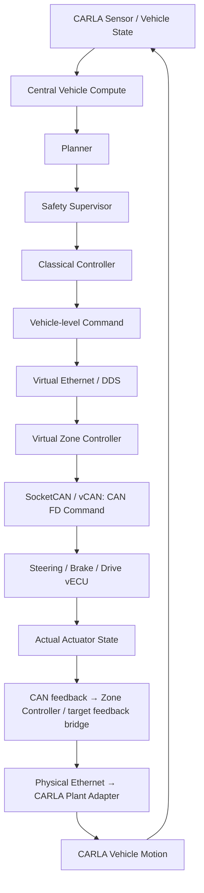

# System architecture

Status: M0 **설계 초안**. 아래 구조는 Planned이며 동작 구현/성능 검증은 없다.

## 경계와 책임

| Component ID | 배치 / 책임 | 경계 |
| --- | --- | --- |
| ARCH-HOST | x86 Ubuntu workstation: CARLA Vehicle Plant / Road / Traffic / Pedestrian, Camera / IMU / GNSS | 차량 환경과 센서의 원천; autonomy 결정은 Target 책임 |
| ARCH-ORCH | Host: ScenarioRunner / OpenSCENARIO, Fault/Test Orchestrator, logging, PASS/FAIL 평가 | 시나리오/seed/run ID, fault 시점, 결과 및 환경 기록 |
| ARCH-CENTRAL | Target: vehicle state, perception, world model, planner, deterministic control, health | Vehicle-level command 생성; CARLA actuation API 의존 금지 |
| ARCH-SAFETY | Target Central Vehicle Compute: Safety Supervisor | planner trajectory 검증, fallback/state 기반 제한, Classical Controller 출력 제한의 별도 guard |
| ARCH-ZONE | Target: gateway, command validation, control allocation, local safety | Vehicle-level command를 actuator command로 변환; freshness와 local fault 판단 |
| ARCH-VECU | Target: Steering / Brake / Drive software ECU | command 수신부터 task/state/dynamics를 거쳐 actual actuator feedback 생성 |
| ARCH-ADAPTER | Host: CARLA Plant Adapter; Target feedback bridge와 연결 | vECU actual feedback만 ego actuation 입력으로 변환; CARLA actuation의 단일 writer |
| ARCH-DIAG | Target Central Vehicle Compute: Diagnostics Manager + Zone Controller/vECU local monitors | fault event 집계, DTC, state transition; local 반응은 Central Vehicle Compute 통신에 의존하지 않음 |

Host–Target은 **실제 Ethernet**이다. Target은 Jetson AGX Thor **또는** Jetson
Orin NX 한 대다. 동일 Vehicle SW Architecture를 보드별 독립 배포하며 두 보드를
연결해 하나의 차량으로 구성하지 않는다.

## Closed-loop invariant

Classical Controller가 CARLA API로 차량을 직접 움직이면 architecture 위반이다. Zone Controller에서
보낸 command를 actual response로 간주하거나 Plant Adapter에서 command로 우회하는
것도 금지한다. vECU task, delay, saturation, fault가 반영된 feedback이 실제
plant 입력을 결정해야 한다. Host fault orchestrator의 명시적 disturbance는
별도 기록하고 정상 control path와 구분한다. Ego autopilot과 다른 actuation
writer는 Planned 통합에서 비활성화해야 한다.

vECU feedback은 CAN → Zone Controller 수집/target bridge → Ethernet → Host Plant Adapter로
전달하는 계약 초안이다. bridge의 구체 구현/프로토콜은 TBD이며 Zone Controller 내부
모듈로 둘지 별도 process로 둘지는 ICD 검토에서 결정한다.

## Plant fidelity와 시간

Steering angle, brake pressure, drive torque를 CARLA의 적용 가능한 plant 입력으로
변환하는 calibration과 단위 계약은 TBD다. CARLA 내부 dynamics와 vECU dynamics를
중복 적용하지 않도록 M6/M7에서 책임을 검토한다. 물리 모델을 완전히 재현했다고
주장하지 않는다. Feedback stale/누락 시 raw command로 대체하지 않으며,
[안전 계약](../requirements/safety_requirements.md)에 따라 Plant Adapter 동작을 결정한다.

SIL 재현 모드의 synchronous/fixed-step과 wall-clock timing 시험을 구분한다.
한 Host orchestrator만 simulation tick을 소유하는 방향이며 step 크기, multirate
vECU 처리, timeout clock과 Host–Target 동기화는 TBD다. simulation이 느리게
진행해도 target의 deadline miss를 숨기지 않아야 한다. 공식
[CARLA synchrony 문서](https://carla.readthedocs.io/en/0.9.16/adv_synchrony_timestep/)의
simulation time / real time 구분을 참고한다.

## M0 open questions

- 초기 ODD: 도로 종류, 속도 범위, 날씨, traffic density와 최소 scenario는 무엇인가?
- 어떤 actuator 물리량/단위와 Plant Adapter mapping을 검증할 것인가?
- Zone Controller feedback bridge, Host ingress transport와 clock 동기화는 어떻게 정할 것인가?
- 단일 Zone Controller 시작 후 확장 여부, process/isolation 구성은 무엇인가?
- communication loss/부분 actuator 상실 시 실제 가능한 safe behavior는 무엇인가?

관련 결정: [ADR-0001](../adr/ADR-0001-simulator-selection.md),
[ADR-0002](../adr/ADR-0002-zonal-architecture.md).
